# tempo

크로스핏·웨이트 트레이닝을 위한 올인원 운동 타이머. 타이머, 스톱워치, 인터벌을 앱 하나로 오가며 쓸 수 있는 iOS 네이티브 앱이다.

## 스크린샷

### 온보딩

| 온보딩 |
| --- |
|  |

### 타이머 · 스톱워치

| 타이머 | 스톱워치 |
| --- | --- |
| 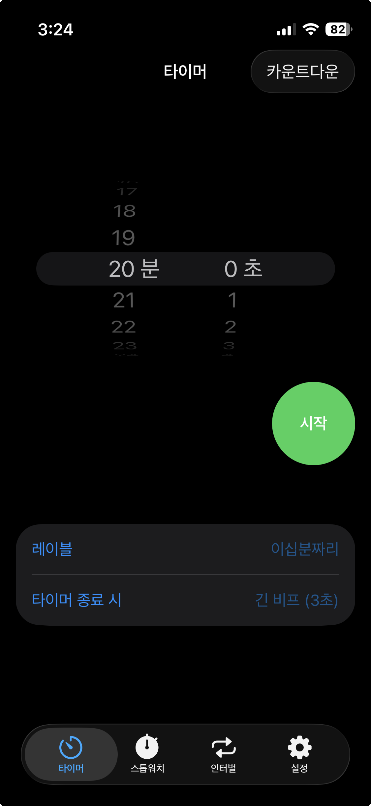 | 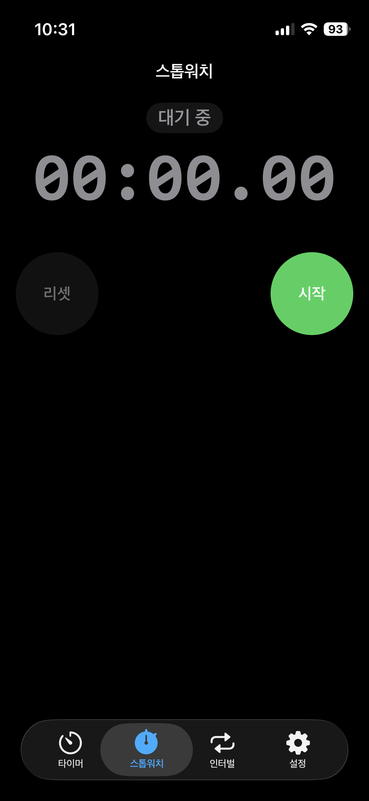 |

### 인터벌

| 프로그램 목록 | 새 프로그램 만들기 | 프로그램 상세 | 프로그램 수정 |
| --- | --- | --- | --- |
| 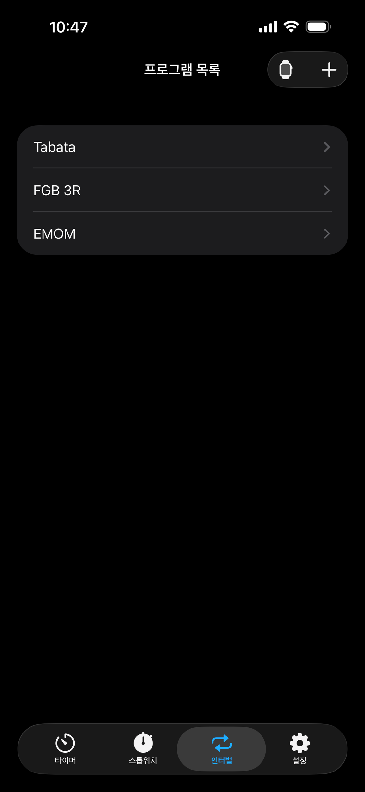 | 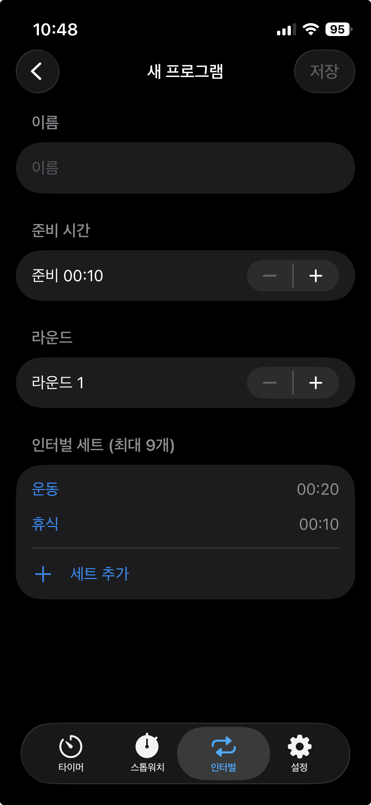 | 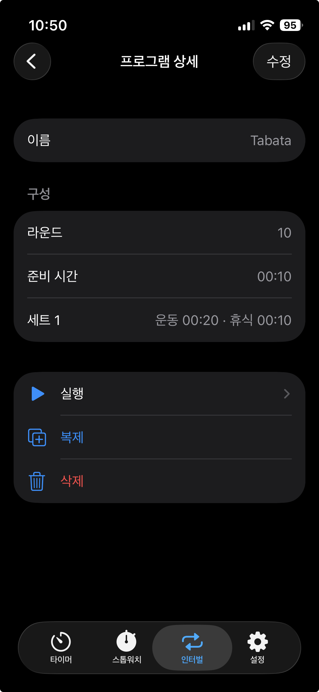 | 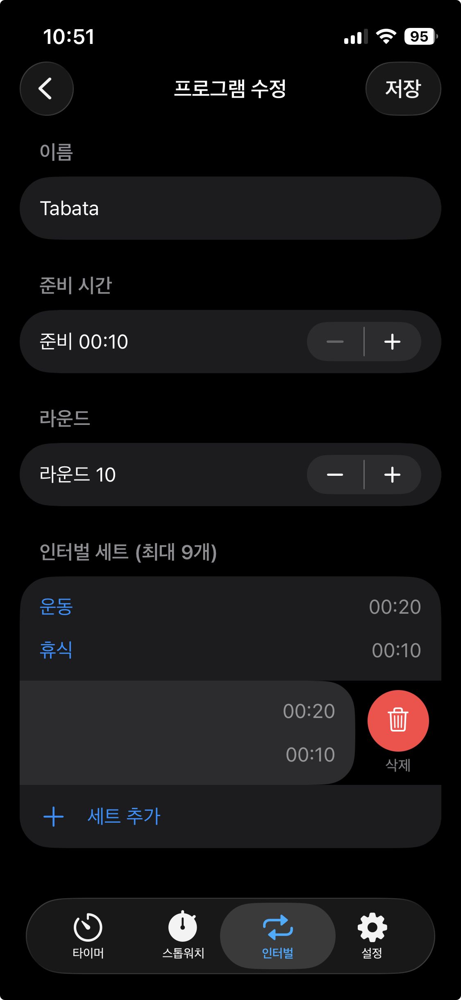 |

| 인터벌 실행 |
| --- |
| 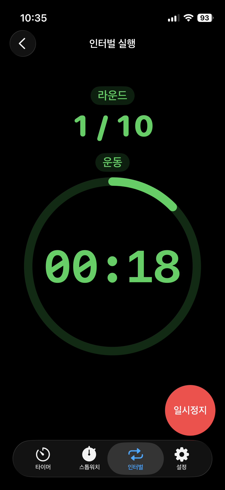 |

### 설정

| 설정 홈 | 알림 큐 설정 | 내 목소리로 녹음하기 | 녹음한 사운드 목록 |
| --- | --- | --- | --- |
| 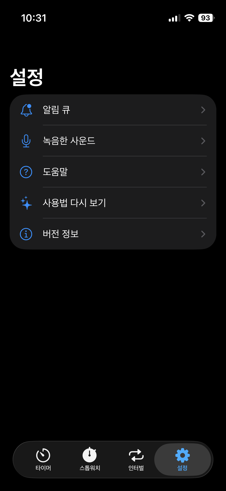 | 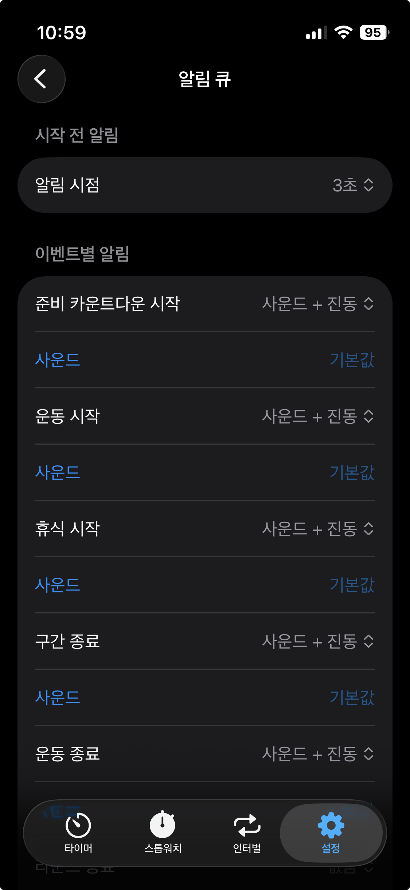 | 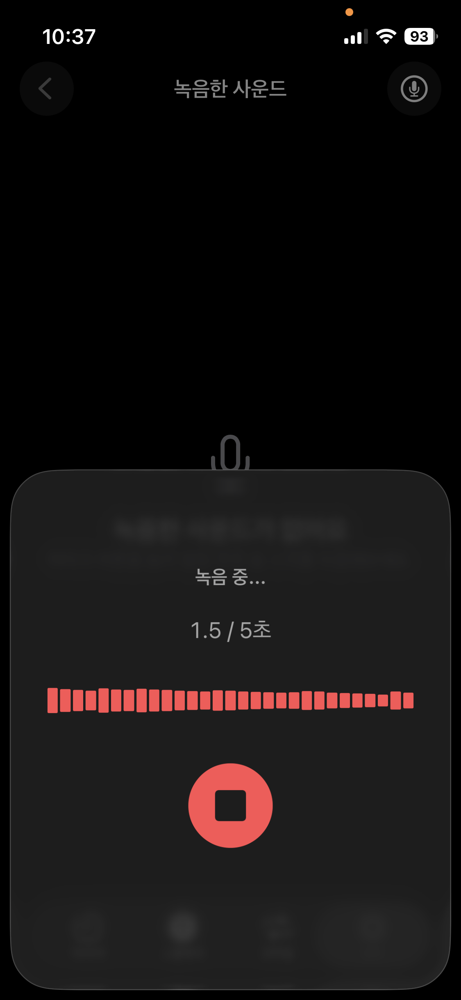 | 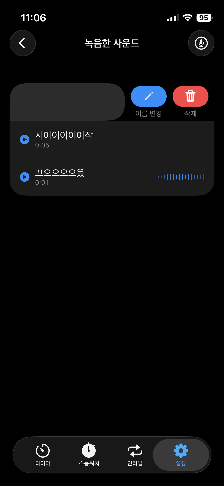 |

<!-- docs/screenshots/*.png 경로에 스크린샷 이미지를 넣으면 위 표에 그대로 표시된다. 파일명 목록은 docs/screenshots/README.md 참고. -->

## 주요 기능

- **하나의 앱, 세 가지 타이밍** — 타이머(카운트다운/카운트업), 스톱워치, 인터벌 타이밍을 한 앱에서 오가며 쓴다.
- **바로 쓰는 기본 프리셋** — Tabata, FGB, EMOM처럼 자주 쓰는 인터벌 구성이 기본으로 준비돼 있고, 그대로 실행하거나 복제해서 내 프리셋으로 바꿀 수 있다.
- **내 프리셋 만들기** — 운동/휴식 시간, 라운드 수, 준비 카운트다운까지 자유롭게 구성해 이름 붙여 저장한다.
- **내 목소리로 알림 큐 만들기** — 구간이 바뀔 때 들려줄 소리를 사운드/진동은 물론, 직접 녹음한 음성(최대 5초, 실시간 파형 표시)으로도 지정할 수 있다.
- **화면 미러링 대응** — 제어센터 화면 미러링으로 TV에 연결하면, 폰 화면을 그대로 복제하는 대신 멀리서도 읽히는 전용 큰 화면을 보여준다.
- **잠금화면·다이나믹 아일랜드 실시간 표시** — 앱을 벗어나도 Live Activity로 진행 상황을 계속 확인할 수 있다.
- **한국어·영어 지원** — 기기 언어 설정에 따라 자동으로 전환된다.

## 시작하기

1. `tempo/tempo.xcodeproj`를 Xcode로 연다.
2. `tempo` 스킴을 선택하고 시뮬레이터 또는 실기기에서 실행한다.

별도 패키지 설치나 빌드 도구 설정은 필요 없다 — SwiftUI + SwiftData 표준 스택만 사용한다.

## 기술 스택

- Swift, SwiftUI
- SwiftData(로컬 영속화)
- SwiftFormat(`.swiftformat`: `--swiftversion 5.0 --indent 4`)

## 문서

기획/설계 문서는 [`docs/`](docs)에 있다.

- [기능명세서](docs/timer-functional-spec.md)
- [내비게이션 구조도](docs/navigation-structure.md)
- [로컬 영속화 전략](docs/local-persistence-strategy.md)
- [네이티브 스타일 가이드](docs/native-style-guide.md)
- [Swift 코딩 컨벤션](docs/swift-coding-conventions.md)
- [테스트 전략](docs/testing-strategy.md)
- [유즈케이스](docs/use-cases)

## 기여

기여 방법은 [`.github/CONTRIBUTING.md`](.github/CONTRIBUTING.md)를 참고한다.
