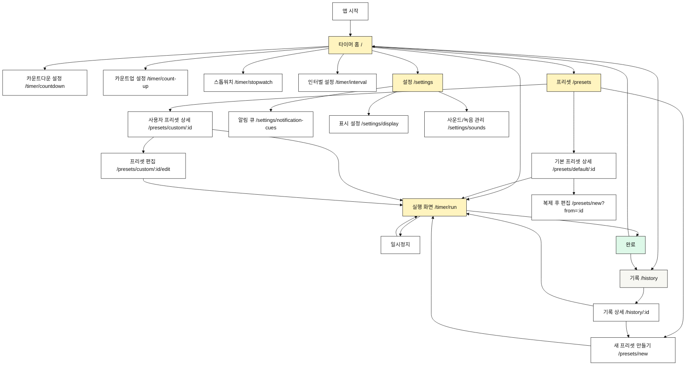

# Tempo 내비게이션 구조도

이 문서는 tempo MVP의 페이지 간 이동 경로를 정의한다.
이런 문서는 보통 `정보 구조(Information Architecture, IA)`, `사이트맵`, 또는 `내비게이션 구조도`라고 부른다.

## 원칙

- 앱의 첫 화면은 타이머 실행과 빠른 시작에 집중한다.
- 주요 기능은 하단 탭에서 접근한다.
- 타이머 실행 중에는 화면 미러링을 고려해 조작보다 시간 표시를 우선한다.
- 프리셋, 알림 큐, 표시 설정은 운동 시작 전 설정 흐름에 둔다.
- 실시간 시계와 하드웨어 전자시계 관련 화면은 제공하지 않는다.

## 최상위 메뉴

| 메뉴  | 경로          | 목적                            |
|-----|-------------|-------------------------------|
| 타이머 | `/`         | 빠른 타이머 선택, 최근 설정 실행, 실행 화면 진입 |
| 프리셋 | `/presets`  | 기본 프리셋과 사용자 프리셋 관리            |
| 기록  | `/history`  | 최근 실행한 타이머와 설정 재사용            |
| 설정  | `/settings` | 알림 큐, 표시, 앱 기본값 설정            |

`기록`은 MVP에서 선택 기능이다. 구현 범위를 줄여야 하면 마지막에 추가한다.

## 전체 구조

## 타이머 흐름

### 타이머 홈 `/`

목적:

- 최근 사용한 타이머를 빠르게 실행한다.
- 카운트다운, 카운트업, 스톱워치, 인터벌 설정으로 이동한다.
- 추천 또는 즐겨찾기 프리셋을 보여준다.

주요 이동:

- `/timer/countdown`
- `/timer/count-up`
- `/timer/stopwatch`
- `/timer/interval`
- `/presets`
- `/settings`

### 카운트다운 설정 `/timer/countdown`

목적:

- 시작 시간을 입력한다.
- 준비 카운트다운과 알림 큐 설정을 확인한다.
- 실행 화면으로 이동한다.

주요 이동:

- 저장 없이 실행: `/timer/run`
- 설정을 프리셋으로 저장: `/presets/new`
- 취소: `/`

### 카운트업 설정 `/timer/count-up`

목적:

- 종료 시간을 입력한다.
- 준비 카운트다운과 알림 큐 설정을 확인한다.
- 실행 화면으로 이동한다.

주요 이동:

- 저장 없이 실행: `/timer/run`
- 설정을 프리셋으로 저장: `/presets/new`
- 취소: `/`

### 스톱워치 `/timer/stopwatch`

목적:

- `00:00.00`부터 경과 시간을 측정한다.
- 준비 카운트다운과 알림 큐는 기본 적용하지 않는다.

주요 이동:

- 실행: 현재 화면에서 시작
- 완료 또는 뒤로가기: `/`

### 인터벌 설정 `/timer/interval`

목적:

- 운동 시간, 휴식 시간, 라운드 수를 입력한다.
- 최대 9개 인터벌 세트를 구성한다.
- 설정을 바로 실행하거나 프리셋으로 저장한다.

주요 이동:

- 실행: `/timer/run`
- 프리셋 저장: `/presets/new`
- 취소: `/`

### 실행 화면 `/timer/run`

목적:

- 큰 시간 숫자와 현재 구간을 표시한다.
- 미러링 상황에서도 멀리서 읽을 수 있게 한다.
- 시작, 일시정지, 재개, 리셋을 제공한다.

주요 이동:

- 완료: `/`
- 완료 후 기록 보기: `/history/:id`
- 설정 수정: 직전 설정 화면 또는 프리셋 편집 화면

## 프리셋 흐름

### 프리셋 목록 `/presets`

목적:

- 기본 제공 프리셋과 사용자 프리셋을 보여준다.
- 기본 제공 프리셋: Tabata, FGB 5R, FGB 3R, EMOM
- 사용자 프리셋: 사용자가 이름 붙인 프리셋

주요 이동:

- 기본 프리셋 상세: `/presets/default/:id`
- 사용자 프리셋 상세: `/presets/custom/:id`
- 새 프리셋 만들기: `/presets/new`

### 기본 프리셋 상세 `/presets/default/:id`

목적:

- 기본 프리셋 설정을 확인한다.
- 바로 실행한다.
- 복제하여 사용자 프리셋으로 만든다.

주요 이동:

- 실행: `/timer/run`
- 복제: `/presets/new?from=:id`
- 뒤로가기: `/presets`

### 사용자 프리셋 상세 `/presets/custom/:id`

목적:

- 사용자 프리셋 설정을 확인한다.
- 실행, 편집, 복제, 삭제를 제공한다.

주요 이동:

- 실행: `/timer/run`
- 편집: `/presets/custom/:id/edit`
- 복제: `/presets/new?from=:id`
- 삭제 후: `/presets`

### 새 프리셋 만들기 `/presets/new`

목적:

- 이름, 인터벌 세트, 라운드, 알림 큐를 설정한다.
- 저장 후 프리셋 상세로 이동한다.

주요 이동:

- 저장: `/presets/custom/:id`
- 저장 후 실행: `/timer/run`
- 취소: `/presets`

## 설정 흐름

### 설정 홈 `/settings`

목적:

- 앱의 기본 설정 화면이다.
- 알림 큐, 표시 설정, 사운드/녹음 관리로 이동한다.

주요 이동:

- `/settings/notification-cues`
- `/settings/display`
- `/settings/sounds`

### 알림 큐 `/settings/notification-cues`

목적:

- 알림 방식을 설정한다.
- 시작 전 알림 시점을 설정한다.
- 이벤트별 알림을 관리한다.

주요 설정:

- 없음
- 사운드
- 진동
- 사운드 + 진동
- 시작 전 알림: 없음, 1초, 3초, 5초, 10초

### 표시 설정 `/settings/display`

목적:

- 라이트 모드와 다크 모드를 확인한다.
- 타이머 화면 밝기 또는 대비 테마를 설정한다.
- 미러링 화면 표시 방식을 조정한다.

### 사운드/녹음 관리 `/settings/sounds`

목적:

- 기본 사운드를 미리듣기한다.
- 후속 단계에서 음원 파일과 직접 녹음 음성 큐를 관리한다.

MVP에서는 구조만 준비하고, 실제 파일 선택과 녹음 기능은 후속 단계로 구현해도 된다.

## 기록 흐름

### 기록 목록 `/history`

목적:

- 최근 실행한 타이머를 보여준다.
- 같은 설정으로 다시 실행할 수 있게 한다.

MVP에서 범위를 줄여야 하면 이 메뉴는 제외한다.

### 기록 상세 `/history/:id`

목적:

- 실행한 타이머 설정과 결과를 확인한다.
- 같은 설정으로 다시 실행한다.
- 프리셋으로 저장한다.

주요 이동:

- 다시 실행: `/timer/run`
- 프리셋으로 저장: `/presets/new?fromHistory=:id`
- 뒤로가기: `/history`

## 하단 탭 제안

MVP의 하단 탭은 다음 순서를 권장한다.

1. `타이머`
2. `프리셋`
3. `설정`

`기록`은 초기 MVP에서 탭으로 노출하지 않고, 실행 완료 화면이나 프리셋 저장 흐름에서 접근하게 둘 수 있다.

## 검수 기준

- 사용자는 홈에서 2번 이하의 탭으로 주요 타이머를 실행할 수 있어야 한다.
- 사용자는 프리셋을 찾고 바로 실행할 수 있어야 한다.
- 사용자는 기본 프리셋을 삭제할 수 없어야 한다.
- 사용자는 사용자 프리셋을 생성, 편집, 복제, 삭제할 수 있어야 한다.
- 사용자는 알림 큐 설정에 설정 탭에서 접근할 수 있어야 한다.
- 실행 화면은 미러링을 고려해 독립 경로를 가져야 한다.
