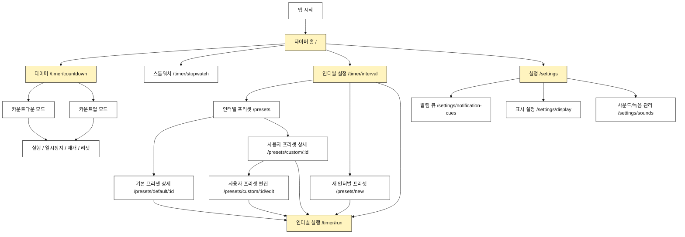

# Tempo 내비게이션 구조도

이 문서는 tempo MVP의 페이지 간 이동 경로를 정의한다.
이런 문서는 보통 `정보 구조(Information Architecture, IA)`, `사이트맵`, 또는 `내비게이션 구조도`라고 부른다.

## 원칙

- 앱의 첫 화면은 타이머 실행과 빠른 시작에 집중한다.
- 하단 탭은 사용하지 않는다.
- `카운트다운`과 `카운트업`은 별도 메뉴로 나누지 않고 `타이머` 안에서 토글로 전환한다.
- 프리셋은 독립 최상위 메뉴가 아니라 인터벌 설정 안에서 접근하는 개념으로 둔다.
- 실행 기록과 히스토리는 1차 MVP에서 제외한다.
- 실시간 시계와 하드웨어 전자시계 관련 화면은 제공하지 않는다.

## 최상위 진입점

| 메뉴 | 경로 | 목적 |
| --- | --- | --- |
| 타이머 | `/timer/countdown` | 카운트다운과 카운트업을 토글로 전환해 실행 |
| 스톱워치 | `/timer/stopwatch` | 별도 설정 없이 경과 시간 측정 |
| 인터벌 | `/timer/interval` | 운동/휴식 구간, 라운드, 인터벌 프리셋 관리 |
| 설정 | `/settings` | 알림 큐, 표시, 사운드 설정 |

홈 `/`은 위 진입점으로 이동하는 시작 화면이다.

## 전체 구조

## 타이머 흐름

### 타이머 홈 `/`

목적:

- 사용자가 바로 실행할 타이머 유형을 선택한다.
- 홈에는 `타이머`, `스톱워치`, `인터벌`을 중심으로 둔다.
- 설정은 보조 진입점으로 둔다.

주요 이동:

- `/timer/countdown`
- `/timer/stopwatch`
- `/timer/interval`
- `/settings`

### 타이머 `/timer/countdown`

목적:

- 하나의 화면 우측 상단 토글 버튼으로 카운트다운과 카운트업을 전환한다.
- 시간, 분, 초를 드래그 picker로 설정한다.
- 시작하면 picker는 수정 불가 상태가 되고 남은 시간 또는 경과 시간을 표시한다.
- 모드 토글은 타이머 상태와 무관하게 항상 접근 가능하다.
- 일시정지 상태에서는 재개와 리셋을 제공한다.

주요 동작:

- 모드 전환: 화면 우측 상단 토글 버튼
- 기본 모드: 카운트다운
- 시작: 현재 모드와 시간으로 실행
- 일시정지: 실행 중인 타이머 정지
- 재개: 남은 시간 또는 경과 시간부터 이어서 실행
- 리셋: 설정 화면으로 복귀

`/timer/count-up`은 별도 라우트로 사용하지 않는다.

### 스톱워치 `/timer/stopwatch`

목적:

- `00:00.00`부터 경과 시간을 측정한다.
- 준비 카운트다운과 알림 큐는 기본 적용하지 않는다.

주요 동작:

- 시작
- 일시정지
- 재개
- 리셋

### 인터벌 설정 `/timer/interval`

목적:

- 운동 시간, 휴식 시간, 라운드 수를 입력한다.
- 최대 9개 인터벌 세트를 구성한다.
- 기본 제공 인터벌 프리셋과 사용자 프리셋을 이 화면 안에서 선택한다.

주요 이동:

- 인터벌 실행: `/timer/run`
- 인터벌 프리셋 목록: `/presets`
- 새 인터벌 프리셋 만들기: `/presets/new`
- 취소: `/`

### 인터벌 실행 `/timer/run`

목적:

- 큰 시간 숫자와 현재 구간을 표시한다.
- 미러링 상황에서도 멀리서 읽을 수 있게 한다.
- 시작, 일시정지, 재개, 리셋을 제공한다.

주요 이동:

- 완료: `/`
- 설정 수정: 직전 인터벌 설정 화면 또는 프리셋 편집 화면

## 프리셋 흐름

프리셋은 인터벌 설정의 하위 개념으로 둔다.
카운트다운과 카운트업은 프리셋으로 저장하지 않는다.

### 인터벌 프리셋 목록 `/presets`

목적:

- 기본 제공 프리셋과 사용자 프리셋을 보여준다.
- 기본 제공 프리셋: Tabata, FGB 5R, FGB 3R, EMOM
- 사용자 프리셋: 사용자가 이름 붙인 인터벌 프리셋

주요 이동:

- 기본 프리셋 상세: `/presets/default/:id`
- 사용자 프리셋 상세: `/presets/custom/:id`
- 새 프리셋 만들기: `/presets/new`

### 기본 프리셋 상세 `/presets/default/:id`

목적:

- 기본 프리셋 설정을 확인한다.
- 바로 실행한다.
- 복제하여 사용자 프리셋으로 만든다.

주요 이동:

- 실행: `/timer/run`
- 복제: `/presets/new?from=:id`
- 뒤로가기: `/presets`

### 사용자 프리셋 상세 `/presets/custom/:id`

목적:

- 사용자 프리셋 설정을 확인한다.
- 실행, 편집, 복제, 삭제를 제공한다.

주요 이동:

- 실행: `/timer/run`
- 편집: `/presets/custom/:id/edit`
- 복제: `/presets/new?from=:id`
- 삭제 후: `/presets`

### 새 프리셋 만들기 `/presets/new`

목적:

- 이름, 인터벌 세트, 라운드, 알림 큐를 설정한다.
- 저장 후 프리셋 상세로 이동한다.

주요 이동:

- 저장: `/presets/custom/:id`
- 저장 후 실행: `/timer/run`
- 취소: `/presets`

## 설정 흐름

### 설정 홈 `/settings`

목적:

- 앱의 기본 설정 화면이다.
- 알림 큐, 표시 설정, 사운드/녹음 관리로 이동한다.

주요 이동:

- `/settings/notification-cues`
- `/settings/display`
- `/settings/sounds`

### 알림 큐 `/settings/notification-cues`

목적:

- 알림 방식을 설정한다.
- 시작 전 알림 시점을 설정한다.
- 이벤트별 알림을 관리한다.

주요 설정:

- 없음
- 사운드
- 진동
- 사운드 + 진동
- 시작 전 알림: 없음, 1초, 3초, 5초, 10초

### 표시 설정 `/settings/display`

목적:

- 라이트 모드와 다크 모드를 확인한다.
- 타이머 화면 밝기 또는 대비 테마를 설정한다.
- 미러링 화면 표시 방식을 조정한다.

### 사운드/녹음 관리 `/settings/sounds`

목적:

- 기본 사운드를 미리듣기한다.
- 후속 단계에서 음원 파일과 직접 녹음 음성 큐를 관리한다.

MVP에서는 구조만 준비하고, 실제 파일 선택과 녹음 기능은 후속 단계로 구현해도 된다.

## 검수 기준

- 홈에서 카운트다운과 카운트업을 별도 메뉴로 노출하지 않아야 한다.
- 타이머 안에서 카운트다운과 카운트업을 토글로 전환할 수 있어야 한다.
- 타이머 실행 중에는 시간 picker를 수정할 수 없어야 한다.
- 타이머의 모드 토글은 타이머 상태와 무관하게 항상 접근 가능해야 한다.
- 프리셋은 인터벌 설정 안에서 접근하는 개념이어야 한다.
- 실행 기록과 히스토리는 1차 MVP 정보구조에 포함하지 않아야 한다.
- 사용자는 프리셋을 찾고 바로 실행할 수 있어야 한다.
- 사용자는 기본 프리셋을 삭제할 수 없어야 한다.
- 사용자는 사용자 프리셋을 생성, 편집, 복제, 삭제할 수 있어야 한다.
- 사용자는 알림 큐 설정에 접근할 수 있어야 한다.
- 실행 화면은 미러링을 고려해 독립 경로를 가져야 한다.

하드웨어 디스플레이 연동은 현재 범위에서 제외한다.
