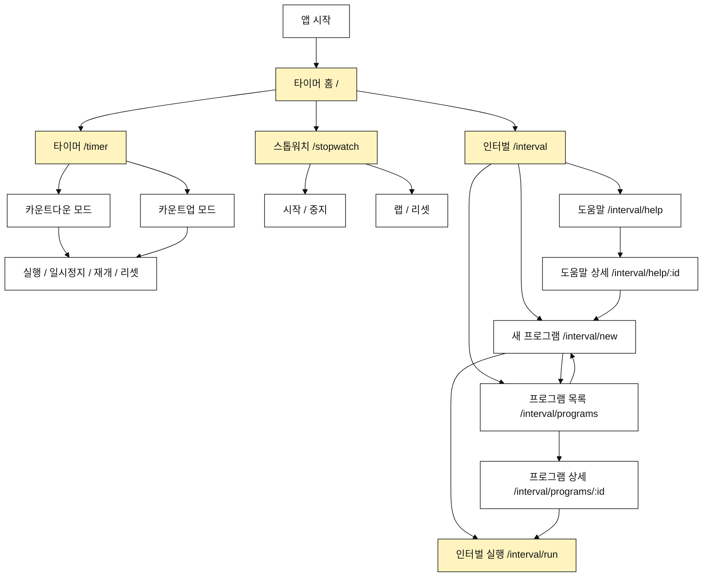

# Tempo 내비게이션 구조도

이 문서는 tempo MVP의 페이지 간 이동 경로를 정의한다.
이런 문서는 보통 `정보 구조(Information Architecture, IA)`, `사이트맵`, 또는 `내비게이션 구조도`라고 부른다.

## 원칙

- 앱의 첫 화면은 `타이머`, `스톱워치`, `인터벌` 세 가지 핵심 실행 흐름에 집중한다.
- `카운트다운`과 `카운트업`은 별도 라우트로 나누지 않고 `/timer` 안에서 토글로 전환한다.
- 저장된 인터벌 구성은 `프로그램 목록`에서 관리한다.
- 실행 기록, 히스토리는 1차 MVP의 화면 IA에서 제외한다.
- 실시간 시계와 하드웨어 전자시계 관련 화면은 제공하지 않는다.

## 최상위 진입점

| 메뉴 | 경로 | 목적 |
| --- | --- | --- |
| 타이머 | `/timer` | 카운트다운과 카운트업을 토글로 전환해 실행 |
| 스톱워치 | `/stopwatch` | 제한 시간 없이 경과 시간과 랩 측정 |
| 인터벌 | `/interval` | 인터벌 프로그램 생성, 저장된 프로그램 선택, 도움말 확인 |

홈 `/`은 위 진입점으로 이동하는 시작 화면이다.

## 전체 구조

## 홈 `/`

목적:

- 사용자가 바로 실행할 타이머 유형을 선택한다.
- 홈에는 `타이머`, `스톱워치`, `인터벌`만 둔다.

주요 이동:

- `/timer`
- `/stopwatch`
- `/interval`

## 타이머 `/timer`

목적:

- 하나의 화면 우측 상단 토글 버튼으로 카운트다운과 카운트업을 전환한다.
- 시간, 분, 초를 네이티브 picker로 설정한다.
- 시작하면 picker는 수정 불가 상태가 되고 남은 시간 또는 경과 시간을 표시한다.
- 모드 토글은 타이머 상태와 무관하게 항상 접근 가능하다.
- 일시정지 상태에서는 재개와 리셋을 제공한다.

주요 동작:

- 기본 모드: 카운트다운
- 모드 전환: 화면 우측 상단 토글 버튼
- 시작: 현재 모드와 시간으로 실행
- 일시정지: 실행 중인 타이머 정지
- 재개: 남은 시간 또는 경과 시간부터 이어서 실행
- 리셋: 설정 화면으로 복귀

`/timer/countdown`과 `/timer/count-up`은 별도 라우트로 사용하지 않는다.

## 스톱워치 `/stopwatch`

목적:

- `00:00:00.00`부터 제한 없이 경과 시간을 측정한다.
- 랩을 기록한다.
- 준비 카운트다운과 알림 큐는 기본 적용하지 않는다.

주요 동작:

- 시작
- 중지
- 랩
- 리셋

## 인터벌 `/interval`

목적:

- 인터벌 프로그램 관련 흐름의 진입점이다.
- `새 프로그램`, `프로그램 목록`, `도움말` 세 가지 메뉴를 제공한다.

주요 이동:

- 새 프로그램: `/interval/new`
- 프로그램 목록: `/interval/programs`
- 도움말: `/interval/help`

## 새 프로그램 `/interval/new`

목적:

- 이름, 구간 구성, 라운드, 알림 큐를 단계적으로 선택한다.
- 우측 상단 저장 버튼으로 프로그램을 저장한다.
- 저장 후 프로그램 상세 화면으로 이동한다.

주요 이동:

- 저장: `/interval/programs/:id`
- 취소 또는 뒤로가기: `/interval`

## 프로그램 목록 `/interval/programs`

목적:

- 저장된 사용자 인터벌 프로그램을 목록으로 보여준다.
- 저장된 프로그램이 없으면 fallback component를 보여준다.
- 목록이 길어지면 페이지네이션 없이 스크롤로 탐색한다.

주요 이동:

- 새 프로그램: `/interval/new`
- 도움말: `/interval/help`
- 프로그램 상세: `/interval/programs/:id`

## 프로그램 상세 `/interval/programs/:id`

목적:

- 저장된 인터벌 프로그램 설정을 확인한다.
- 실행하거나 목록으로 돌아간다.

주요 이동:

- 실행: `/interval/run`
- 목록으로가기: `/interval/programs`

## 도움말 `/interval/help`

목적:

- Tabata, EMOM, FGB 스타일, 사용자 커스텀 프로그램명을 목록으로 보여준다.
- 상세 설명은 별도 상세 페이지에서 제공한다.

주요 이동:

- 도움말 상세: `/interval/help/:id`

## 도움말 상세 `/interval/help/:id`

목적:

- 선택한 프로그램을 tempo 인터벌 입력값으로 만드는 방법을 설명한다.
- EMOM은 일반적으로 1분짜리 구간을 n라운드 반복하거나 휴식 시간을 0으로 둔 프로그램으로 설명한다.
- 40초 운동, 20초 휴식 같은 구성은 사용자 커스텀 인터벌 예시로 설명한다.

주요 이동:

- 새 프로그램 만들기: `/interval/new`

## 인터벌 실행 `/interval/run`

목적:

- 큰 시간 숫자와 현재 구간, 라운드 정보를 표시한다.
- 미러링 상황에서도 멀리서 읽을 수 있게 한다.
- 시작, 일시정지, 재개, 리셋을 제공한다.

주요 이동:

- 완료: `/`
- 설정 수정: `/interval`
