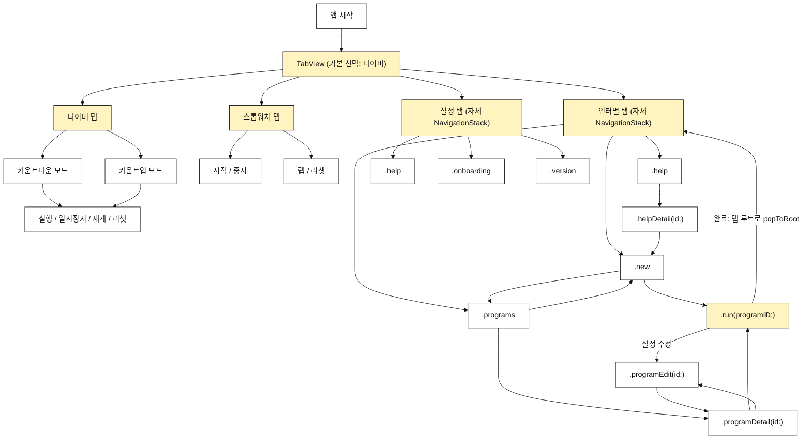

# Tempo 내비게이션 구조도

이 문서는 tempo MVP의 화면 간 이동 경로를 정의한다.
이런 문서는 보통 `정보 구조(Information Architecture, IA)`, `사이트맵`, 또는 `내비게이션 구조도`라고 부른다.

화면 이동은 SwiftUI의 `TabView` + 탭별 `NavigationStack`으로 구현한다. 앱 루트는 `TabView`이고, 탭마다 독립된 값 기반 라우트 enum과 `NavigationStack`을 가진다. 탭을 전환해도 각 탭의 내비게이션 상태(어느 화면까지 들어갔는지)는 그대로 유지된다.

```swift
enum IntervalRoute: Hashable {
    case new
    case programs
    case programDetail(id: String)
    case programEdit(id: String)
    case help
    case helpDetail(id: String)
    case run(programID: String)
}

enum SettingsRoute: Hashable {
    case help
    case onboarding
    case version
}
```

타이머·스톱워치 탭은 화면이 하나뿐이라 별도 라우트 enum이 필요 없다.

## 원칙

- 앱 실행 시 하단 탭바가 항상 보이고, 기본 선택 탭은 **타이머**다.
- 탭은 `타이머` / `스톱워치` / `인터벌` / `설정` 4개다. 애플 기본 시계 앱과 같은 하단 탭바 패턴을 따른다 — `docs/native-style-guide.md`의 "iOS 기본 앱과 동일한 느낌" 원칙과 맞닿아 있다.
- `카운트다운`과 `카운트업`은 별도 탭이나 라우트로 나누지 않고 `타이머` 탭 화면 안에서 토글로 전환한다.
- 저장된 인터벌 구성은 `인터벌` 탭 안의 `프로그램 목록`에서 관리한다.
- 실행 기록, 히스토리는 1차 MVP의 화면 IA에서 제외한다.
- 실시간 시계와 하드웨어 전자시계 관련 화면은 제공하지 않는다.
- 설정 탭에서 도움말, 사용법(온보딩) 다시 보기, 버전 정보를 확인할 수 있다.

## 최상위 탭

| 탭 | 아이콘(SF Symbol) | 목적 |
| --- | --- | --- |
| 타이머 | `timer` | 카운트다운과 카운트업을 토글로 전환해 실행 |
| 스톱워치 | `stopwatch` | 제한 시간 없이 경과 시간과 랩 측정 |
| 인터벌 | `repeat` | 인터벌 프로그램 생성, 저장된 프로그램 선택, 도움말 확인 |
| 설정 | `gearshape.fill` | 도움말, 사용법 다시 보기, 버전 정보 |

## 전체 구조


```mermaid
%%{init: {"theme": "base", "themeVariables": {"background": "transparent", "primaryColor": "#FFFFFF", "primaryTextColor": "#111111", "primaryBorderColor": "#111111", "lineColor": "#111111", "tertiaryColor": "#F7F7F2"}}}%%
flowchart TD
    A["앱 시작"] --> TB["TabView (기본 선택: 타이머)"]
    TB --> T["타이머 탭"]
    TB --> S["스톱워치 탭"]
    TB --> I["인터벌 탭 (자체 NavigationStack)"]
    TB --> G["설정 탭 (자체 NavigationStack)"]

    T --> T1["카운트다운 모드"]
    T --> T2["카운트업 모드"]
    T1 --> T3["실행 / 일시정지 / 재개 / 리셋"]
    T2 --> T3

    S --> S1["시작 / 중지"]
    S --> S2["랩 / 리셋"]

    I --> N[".new"]
    I --> P[".programs"]
    I --> H[".help"]
    H --> H1[".helpDetail(id:)"]

    N --> R[".run(programID:)"]
    N --> P
    P --> P2[".programDetail(id:)"]
    P --> N
    P2 --> R
    P2 --> E[".programEdit(id:)"]
    E --> P2
    H1 --> N
    R -->|완료: 탭 루트로 popToRoot| I
    R -->|설정 수정| E

    G --> GH[".help"]
    G --> GO[".onboarding"]
    G --> GV[".version"]

    classDef primary fill:#FFF4BF,stroke:#111111,color:#111111;
    classDef screen fill:#FFFFFF,stroke:#111111,color:#111111;
    class TB,T,S,I,G,R primary;
    class T1,T2,T3,S1,S2,N,P,H,H1,P2,E,GH,GO,GV screen;
```

## 타이머 탭

목적:

- 하나의 화면 우측 상단 토글 버튼으로 카운트다운과 카운트업을 전환한다.
- 시간, 분, 초를 네이티브 `Picker`(wheel style)로 설정한다.
- 시작하면 picker는 수정 불가 상태가 되고 남은 시간 또는 경과 시간을 표시한다.
- 모드 토글은 타이머 상태와 무관하게 항상 접근 가능하다.
- 일시정지 상태에서는 재개와 리셋을 제공한다.

주요 동작:

- 기본 모드: 카운트다운
- 모드 전환: 화면 우측 상단 토글 버튼
- 시작: 현재 모드와 시간으로 실행
- 일시정지: 실행 중인 타이머 정지
- 재개: 남은 시간 또는 경과 시간부터 이어서 실행
- 리셋: 설정 화면으로 복귀

카운트다운/카운트업은 타이머 탭 화면 내부 상태(`mode`)로만 구분하고, 별도 라우트를 두지 않는다.

## 스톱워치 탭

목적:

- `00:00:00.00`부터 제한 없이 경과 시간을 측정한다.
- 랩을 기록한다.
- 준비 카운트다운과 알림 큐는 기본 적용하지 않는다.

주요 동작:

- 시작
- 중지
- 랩
- 리셋

## 인터벌 탭

인터벌 탭은 자체 `NavigationStack`을 가지며, 탭을 벗어났다가 돌아와도 마지막으로 보던 화면이 그대로 유지된다.

### 루트 (인터벌 탭 홈, `.programs`와 동일 화면)

목적:

- 인터벌 탭을 열면 바로 저장된 프로그램 목록이 보인다. 별도 메뉴 화면은 없다.
- 우측 상단 "+" 버튼으로 새 프로그램을 만든다.

주요 이동:

- 새 프로그램: `.new`
- 프로그램 상세: `.programDetail(id:)`

### 새 프로그램 `.new`

목적:

- 이름, 구간 구성, 라운드, 알림 큐를 단계적으로 선택한다.
- 우측 상단 저장 버튼으로 프로그램을 저장한다.
- 저장 후 프로그램 상세 화면으로 이동한다.

주요 이동:

- 저장: `.programDetail(id:)`
- 취소 또는 뒤로가기: 인터벌 탭 루트 (또는 `navigationPath.removeLast()`)

### 프로그램 목록 `.programs`

목적:

- 저장된 사용자 인터벌 프로그램을 목록으로 보여준다.
- 저장된 프로그램이 없으면 fallback view를 보여준다.
- 목록이 길어지면 페이지네이션 없이 스크롤로 탐색한다 (`List`).

주요 이동:

- 새 프로그램: `.new`
- 프로그램 상세: `.programDetail(id:)`

### 프로그램 상세 `.programDetail(id:)`

목적:

- 저장된 인터벌 프로그램 설정을 확인한다.
- 실행하거나 목록으로 돌아간다.

주요 이동:

- 실행: `.run(programID:)`
- 수정: `.programEdit(id:)`
- 목록으로가기: `.programs` (또는 `navigationPath.removeLast()`)

### 프로그램 수정 `.programEdit(id:)`

목적:

- 저장된 인터벌 프로그램의 이름, 준비/운동/휴식 시간, 라운드, 알림 큐를 단계적으로 수정한다.
- 화면 구성은 `.new`와 동일한 단계형 흐름을 재사용한다.

주요 이동:

- 저장: `.programDetail(id:)`로 복귀 (`navigationPath.removeLast()`)
- 취소 또는 뒤로가기: `.programDetail(id:)`로 복귀 (`navigationPath.removeLast()`)

### 인터벌 실행 `.run(programID:)`

목적:

- 큰 시간 숫자와 현재 구간, 라운드 정보를 표시한다.
- 미러링 상황에서도 멀리서 읽을 수 있게 한다.
- 시작, 일시정지, 재개, 리셋을 제공한다.

주요 이동:

- 완료: 인터벌 탭 루트로 복귀 (`navigationPath.removeLast(navigationPath.count)`) — 앱 전체 홈이 아니라 **이 탭의 루트**로만 돌아간다.
- 설정 수정: `.programEdit(id:)`

## 설정 탭

설정 탭도 자체 `NavigationStack`을 가진다. moov의 "관리" 탭을 참고했다.

### 루트 (설정 탭 홈)

목적:

- 도움말, 사용법 다시 보기, 버전 정보로 이동하는 진입점이다.

주요 이동:

- 도움말: `.help`
- 사용법 다시 보기: `.onboarding`
- 버전 정보: `.version`

### 도움말 `.help`

목적:

- 이용 가이드 콘텐츠(각 타이머 모드 설명, 알림 큐 설정법 등)를 제공한다. 콘텐츠는 후속 이슈에서 채운다.

### 사용법 다시 보기 `.onboarding`

목적:

- 최초 실행 온보딩과 같은 콘텐츠를 설정에서 다시 볼 수 있게 한다. 실제 온보딩 단계/콘텐츠는 후속 이슈에서 채운다.

### 버전 정보 `.version`

목적:

- `Bundle.main`에서 읽은 앱 버전(`CFBundleShortVersionString`)과 빌드 번호(`CFBundleVersion`)를 보여준다.
