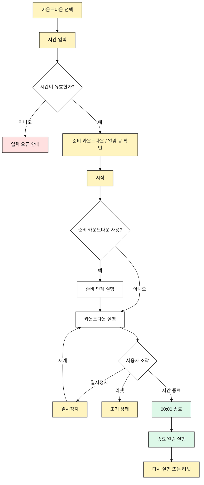

# 카운트다운 유즈케이스

## 목적

사용자는 정해진 시간에서 `00:00`까지 감소하는 타이머를 실행한다.

## 주요 사용자

- 개인 운동자
- 코치
- 수업 진행자

## 선행 조건

- 사용자는 카운트다운 모드를 선택할 수 있다.
- 사용자는 시간을 `00:00`부터 `99:59` 사이로 입력할 수 있다.

## 기본 흐름

1. 사용자가 카운트다운 모드를 선택한다.
2. 사용자가 시작 시간을 입력한다.
3. 사용자가 준비 카운트다운과 알림 큐 설정을 확인한다.
4. 사용자가 시작 버튼을 누른다.
5. 준비 카운트다운이 켜져 있으면 준비 단계가 실행된다.
6. 타이머가 `00:00`까지 감소한다.
7. 종료 시 알림 큐가 실행된다.
8. 사용자는 같은 설정을 다시 실행하거나 리셋한다.

## 대안 흐름

- 사용자는 실행 중 일시정지할 수 있다.
- 사용자는 일시정지 상태에서 재개할 수 있다.
- 사용자는 실행 중 리셋할 수 있다.
- 입력 시간이 `00:00`이면 시작할 수 없도록 안내한다.

## Mermaid

## 검수 포인트

- `99:59`까지 입력할 수 있다.
- 실행 중 일시정지, 재개, 리셋이 가능하다.
- 종료 시 `00:00`에서 멈춘다.
- 준비 카운트다운과 알림 큐 설정이 반영된다.

