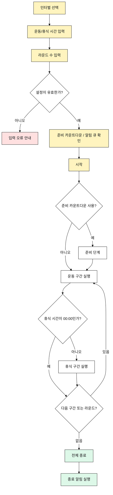

# 인터벌 타이밍 유즈케이스

## 목적

사용자는 운동 구간과 휴식 구간을 라운드 단위로 반복 실행한다.

## 주요 사용자

- 크로스핏 코치
- 개인 운동자
- 복싱, MMA, 서킷 트레이닝 사용자

## 선행 조건

- 사용자는 인터벌 모드를 선택할 수 있다.
- 사용자는 최소 1개의 인터벌 세트를 입력한다.
- 하나의 프리셋은 최대 9개의 인터벌 세트와 최대 99라운드를 가진다.

## 기본 흐름

1. 사용자가 인터벌 모드를 선택한다.
2. 사용자가 운동 시간과 휴식 시간을 입력한다.
3. 사용자가 라운드 수를 입력한다.
4. 사용자가 준비 카운트다운과 알림 큐 설정을 확인한다.
5. 사용자가 시작 버튼을 누른다.
6. 준비 단계가 필요한 경우 먼저 실행된다.
7. 운동 구간과 휴식 구간이 순서대로 실행된다.
8. 마지막 라운드의 마지막 구간이 끝나면 종료된다.

## 대안 흐름

- 휴식 시간이 `00:00`이면 휴식 구간을 건너뛴다.
- 사용자는 실행 중 일시정지, 재개, 리셋할 수 있다.
- 입력값이 유효하지 않으면 저장 또는 시작을 막는다.

## Mermaid

## 검수 포인트

- 최대 9개 인터벌 세트와 99라운드를 지원한다.
- 휴식 `00:00`은 건너뛴다.
- 준비 카운트다운과 알림 큐 설정이 반영된다.
- 실행 중 현재 구간, 현재 라운드, 전체 라운드를 표시한다.

