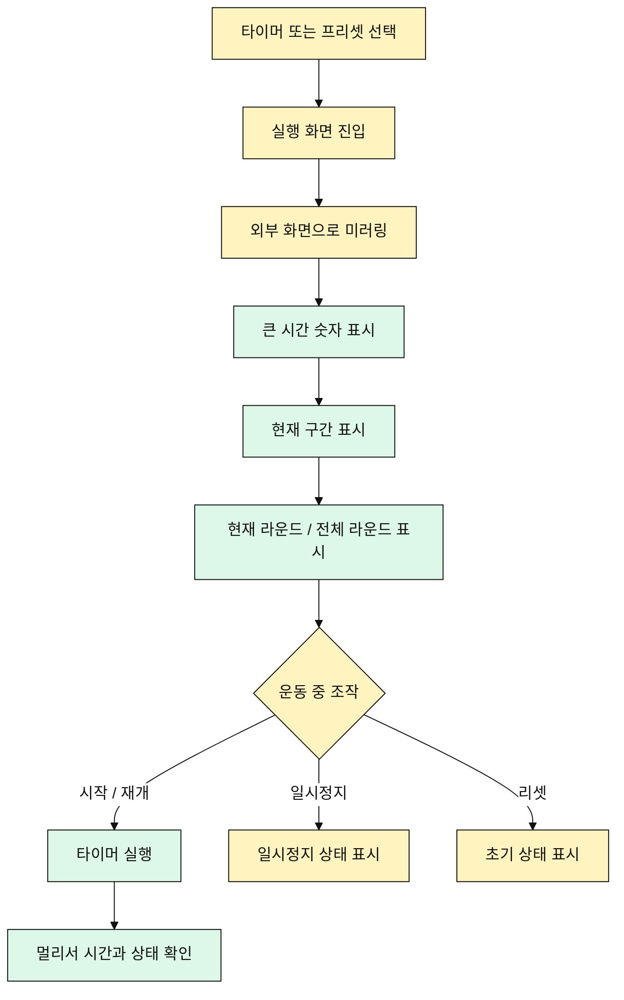

# 미러링 실행 화면 유즈케이스

## 목적

사용자는 모바일 화면을 외부 디스플레이에 미러링하여 운동 중 타이머를 멀리서 확인한다.

## 주요 사용자

- 크로스핏 박스 코치
- 그룹 수업 진행자
- TV나 모니터로 운동 타이머를 띄우는 사용자

## 선행 조건

- 사용자는 모바일 기기에서 타이머를 실행할 수 있다.
- 사용자는 OS 또는 기기 기능으로 화면을 미러링할 수 있다.

## 기본 흐름

1. 사용자가 타이머 또는 프리셋을 선택한다.
2. 사용자가 실행 화면으로 이동한다.
3. 사용자가 기기 화면을 TV나 외부 디스플레이에 미러링한다.
4. 앱은 시간 숫자와 현재 상태를 가장 크게 표시한다.
5. 운동 중 사용자는 큰 화면으로 남은 시간, 구간, 라운드를 확인한다.

## 대안 흐름

- 사용자는 세로 화면과 가로 화면에서 모두 실행 화면을 볼 수 있다.
- 컨트롤 버튼은 시간 숫자를 방해하지 않아야 한다.
- 미러링 중에도 모바일에서 시작, 일시정지, 재개, 리셋을 조작할 수 있다.

## Mermaid

## 검수 포인트

- 시간 숫자가 화면에서 가장 크게 보여야 한다.
- 현재 구간은 텍스트와 색상으로 함께 표현한다.
- 컨트롤 버튼이 시간 표시를 방해하지 않는다.
- 가로 화면에서도 레이아웃이 깨지지 않는다.

