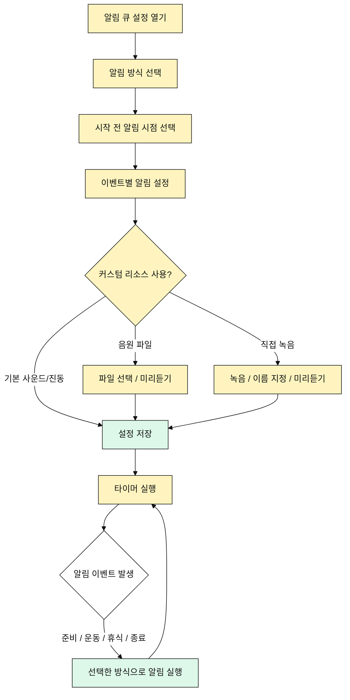

# 알림 큐 유즈케이스

## 목적

사용자는 타이머 상태 변화를 소리, 진동, 음원 파일, 직접 녹음 음성으로 인지한다.

## 주요 사용자

- 화면을 계속 볼 수 없는 운동자
- 수업을 진행하는 코치
- 조용한 환경에서 진동을 선호하는 사용자

## 선행 조건

- 사용자는 알림 큐 설정에 접근할 수 있다.
- 타이머 기능은 알림 이벤트를 발생시킬 수 있다.

## 기본 흐름

1. 사용자가 알림 큐 설정을 연다.
2. 사용자가 알림 방식을 선택한다.
3. 사용자가 시작 전 알림 시점을 선택한다.
4. 사용자가 이벤트별 알림을 확인하거나 수정한다.
5. 사용자가 설정을 저장한다.
6. 타이머 실행 중 이벤트가 발생하면 알림 큐가 실행된다.

## 대안 흐름

- 사용자는 알림 방식을 없음, 사운드, 진동, 사운드 + 진동 중 선택한다.
- 사용자는 시작 전 알림을 없음, 1초, 3초, 5초, 10초 중 선택한다.
- 사용자는 후속 단계에서 음원 파일을 이벤트별로 지정할 수 있다.
- 사용자는 후속 단계에서 직접 녹음한 코치 음성을 이벤트별로 지정할 수 있다.

## Mermaid

## 검수 포인트

- 알림 방식은 없음, 사운드, 진동, 사운드 + 진동을 지원한다.
- 시작 전 알림 시점은 없음, 1초, 3초, 5초, 10초를 지원한다.
- MVP는 기본 사운드와 진동을 제공한다.
- 구조는 음원 파일과 직접 녹음 음성 큐를 수용할 수 있어야 한다.

