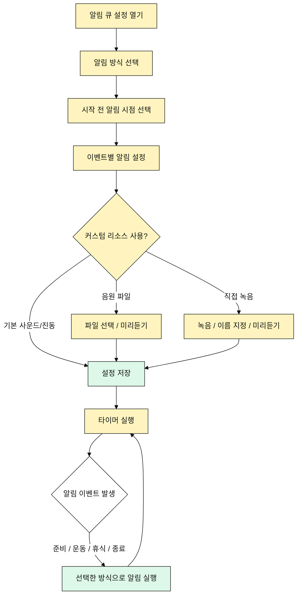

# 알림 큐 유즈케이스

## 목적

사용자는 타이머 상태 변화를 소리, 진동, 음원 파일, 직접 녹음 음성으로 인지한다.

## 주요 사용자

- 화면을 계속 볼 수 없는 운동자
- 수업을 진행하는 코치
- 조용한 환경에서 진동을 선호하는 사용자

## 선행 조건

- 사용자는 알림 큐 설정에 접근할 수 있다.
- 타이머 기능은 알림 이벤트를 발생시킬 수 있다.

## 기본 흐름

1. 사용자가 알림 큐 설정을 연다.
2. 사용자가 알림 방식을 선택한다.
3. 사용자가 시작 전 알림 시점을 선택한다.
4. 사용자가 이벤트별 알림을 확인하거나 수정한다.
5. 사용자가 설정을 저장한다.
6. 타이머 실행 중 이벤트가 발생하면 알림 큐가 실행된다.

## 대안 흐름

- 사용자는 알림 방식을 없음, 사운드, 진동, 사운드 + 진동 중 선택한다.
- 사용자는 시작 전 알림을 없음, 1초, 3초, 5초, 10초 중 선택한다.
- 사용자는 후속 단계에서 음원 파일을 이벤트별로 지정할 수 있다.
- 사용자는 후속 단계에서 직접 녹음한 코치 음성을 이벤트별로 지정할 수 있다.
- 앱이 백그라운드에 있는 동안(홈 화면 이동, 화면 잠금 등)에도 준비/운동/휴식
  시작, 구간·운동·라운드 종료, 마지막 라운드 진입, 전체 종료까지 모든 이벤트가
  로컬 알림(배너+사운드 또는 진동)으로 전달된다. 대상은 타이머(카운트다운)와
  인터벌 타이밍이며, 일시정지·리셋 시에는 예약해둔 알림을 모두 취소한다.
  카운트업과 스톱워치는 대상이 아니다. 애플워치도 인터벌 실행 중에는 동일하게
  백그라운드 알림을 받는다(다만 커스텀 녹음 사운드는 재생 못 해 항상 기본음).
- 아이폰과 애플워치의 실행 상태는 서로 완전히 독립적이라 한쪽 실행이 다른 쪽 알림을
  트리거하지 않는다. 다만 애플워치를 착용 중이면 iOS가 아이폰의 알림을 애플워치로
  미러링해서, 아이폰을 실행했는데 알림은 워치에서만 울리는 것처럼 보일 수 있다 — 이는
  iOS 시스템 동작이며, 아이폰의 Watch 앱 > 알림 > tempo에서 사용자가 직접 조정한다.
- 같은 순간에 여러 이벤트가 겹치면(예: 라운드가 바뀌는 순간) 알림을 여러 개로
  쪼개지 않고 하나로 합쳐서 보낸다 — 잠금화면에서 같은 순간에 알림이 여러 개
  몰리면 일부의 사운드·진동이 누락되는 문제가 있었기 때문이다.
- 전체 종료 로컬 알림을 탭하면 앱이 열리며 해당 프로그램의 인터벌 실행 화면으로
  바로 이동하고, 완료 상태로 보여준다. 그 외 이벤트 알림은 탭하면 앱만 열릴 뿐
  특정 화면으로 강제 이동시키지는 않는다.

## Mermaid

```mermaid
%%{init: {"theme": "base", "themeVariables": {"background": "transparent", "primaryColor": "#FFFFFF", "primaryTextColor": "#111111", "primaryBorderColor": "#111111", "lineColor": "#111111", "tertiaryColor": "#F7F7F2"}}}%%
flowchart TD
  A["알림 큐 설정 열기"] --> B["알림 방식 선택"]
  B --> C["시작 전 알림 시점 선택"]
  C --> D["이벤트별 알림 설정"]
  D --> E{"커스텀 리소스 사용?"}
  E -- "기본 사운드/진동" --> F["설정 저장"]
  E -- "음원 파일" --> G["파일 선택 / 미리듣기"]
  G --> F
  E -- "직접 녹음" --> H["녹음 / 이름 지정 / 미리듣기"]
  H --> F
  F --> I["타이머 실행"]
  I --> J{"알림 이벤트 발생"}
  J -- "준비 / 운동 / 휴식 / 종료" --> K["선택한 방식으로 알림 실행"]
  K --> I

  classDef action fill:#FFF4BF,stroke:#111111,color:#111111;
  classDef done fill:#DDF8E8,stroke:#111111,color:#111111;
  class A,B,C,D,E,G,H,I action;
  class F,K done;
```

## 검수 포인트

- 알림 방식은 없음, 사운드, 진동, 사운드 + 진동을 지원한다.
- 시작 전 알림 시점은 없음, 1초, 3초, 5초, 10초를 지원한다.
- MVP는 기본 사운드와 진동을 제공한다.
- 구조는 음원 파일과 직접 녹음 음성 큐를 수용할 수 있어야 한다.
- 백그라운드 중에는 타이머(카운트다운)와 인터벌의 모든 이벤트가 로컬 알림으로
  온다(일시정지·리셋 시에는 예약이 취소된다. 카운트업·스톱워치는 대상이 아니다).
  애플워치도 동일하게 적용된다.
- 같은 순간에 겹치는 이벤트는 알림 하나로 합쳐져서 온다.
- 전체 종료 로컬 알림을 탭하면 해당 인터벌 실행 화면(완료 상태)으로 이동한다.

