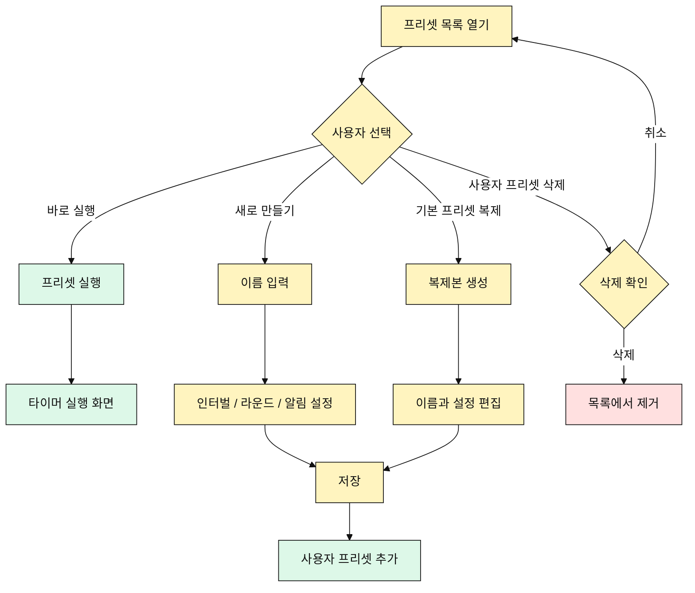

# 프리셋 관리 유즈케이스

## 목적

사용자는 기본 제공 인터벌 프리셋을 실행하거나, 직접 프리셋을 만들고 관리한다.

## 주요 사용자

- 반복 수업을 운영하는 코치
- 개인 운동 루틴을 저장하려는 사용자
- 자주 쓰는 타이머를 빠르게 실행하려는 사용자

## 선행 조건

- 앱은 기본 제공 프리셋을 제공한다.
- 사용자는 프리셋 목록에 접근할 수 있다.

## 기본 흐름

1. 사용자가 프리셋 목록을 연다.
2. 사용자가 기본 제공 프리셋 또는 사용자 프리셋을 선택한다.
3. 사용자가 프리셋을 바로 실행한다.
4. 앱이 해당 프리셋 설정으로 타이머를 실행한다.

## 편집 흐름

1. 사용자가 새 프리셋 만들기를 선택한다.
2. 사용자가 이름을 입력한다.
3. 사용자가 인터벌 세트, 라운드, 알림 큐를 설정한다.
4. 사용자가 저장한다.
5. 새 프리셋이 목록에 추가된다.

## 대안 흐름

- 기본 제공 프리셋은 삭제할 수 없다.
- 기본 제공 프리셋은 복제해서 사용자 프리셋으로 저장할 수 있다.
- 사용자 프리셋은 이름 변경, 편집, 복제, 삭제할 수 있다.
- 최근 사용한 설정은 프리셋으로 저장할 수 있다.

## Mermaid

## 검수 포인트

- Tabata, FGB, EMOM은 기본 제공 인터벌 프리셋으로 제공된다.
- 사용자는 직접 프리셋을 만들고 이름을 붙일 수 있다.
- 사용자 프리셋은 편집, 복제, 삭제, 실행할 수 있다.
- 기본 제공 프리셋은 삭제할 수 없다.

