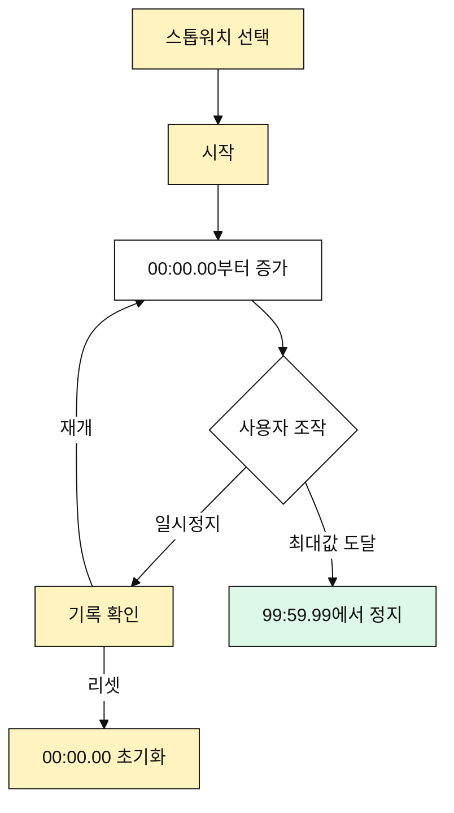

# 스톱워치 유즈케이스

## 목적

사용자는 별도 종료 시간 없이 경과 시간을 측정한다.

## 주요 사용자

- 개인 운동자
- 기록 측정자
- 코치

## 선행 조건

- 사용자는 스톱워치 모드를 선택할 수 있다.

## 기본 흐름

1. 사용자가 스톱워치 모드를 선택한다.
2. 사용자가 시작 버튼을 누른다.
3. 스톱워치가 `00:00.00`에서 증가한다.
4. 사용자가 일시정지한다.
5. 사용자가 기록을 확인한다.
6. 사용자가 재개하거나 리셋한다.

## 대안 흐름

- 스톱워치는 준비 카운트다운을 사용하지 않는다.
- 스톱워치는 기본적으로 알림 큐를 사용하지 않는다.
- 최대 표시값은 `99:59.99`다.

## Mermaid

## 검수 포인트

- 준비 카운트다운이 실행되지 않는다.
- 알림 큐가 기본 적용되지 않는다.
- `99:59.99`까지 표시할 수 있다.
- 시작, 일시정지, 재개, 리셋이 가능하다.

