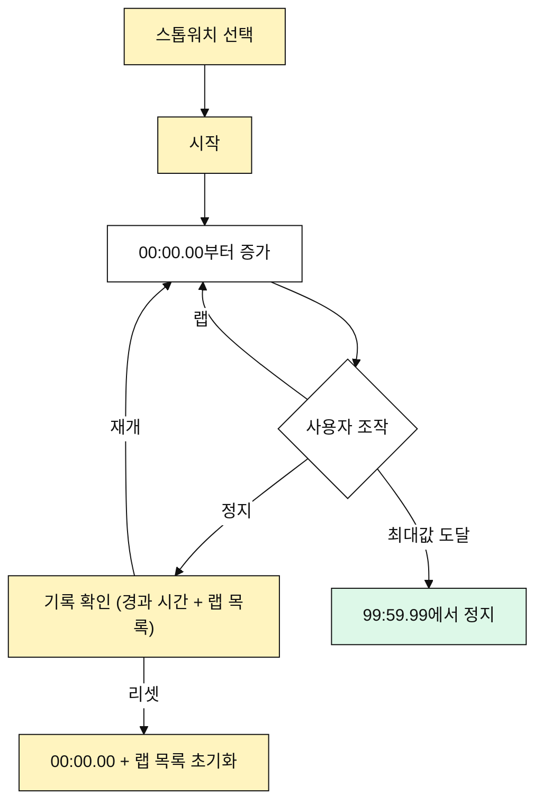

# 스톱워치 유즈케이스

## 목적

사용자는 별도 종료 시간 없이 경과 시간을 측정하고, 필요하면 구간(랩)을 기록한다.

## 주요 사용자

- 개인 운동자
- 기록 측정자
- 코치

## 화면 구성

- 화면 우측 하단: `시작`/`정지` 토글 버튼.
- 화면 좌측 하단: 대기 상태에서는 `리셋`, 실행 중에는 `랩` 버튼으로 바뀐다.
- 버튼 아래에는 기록된 랩 목록이 표시된다. 가장 최근 랩이 맨 위에 온다.
- 랩 항목은 랩 번호, 랩 소요 시간(직전 랩 이후 경과), 전체 누적 경과 시간을 함께 보여준다.

## 선행 조건

- 사용자는 스톱워치 모드를 선택할 수 있다.

## 기본 흐름

1. 사용자가 스톱워치 모드를 선택한다.
2. 사용자가 시작 버튼을 누른다.
3. 스톱워치가 `00:00.00`에서 증가한다.
4. 사용자가 좌측 버튼(랩)을 눌러 구간을 기록한다. 랩 목록 맨 위에 새 항목이 추가된다.
5. 사용자가 정지(일시정지)한다.
6. 사용자가 기록(경과 시간, 랩 목록)을 확인한다.
7. 사용자가 재개하거나 리셋한다.

## 대안 흐름

- 스톱워치는 준비 카운트다운을 사용하지 않는다.
- 스톱워치는 기본적으로 알림 큐를 사용하지 않는다.
- 최대 표시값은 `99:59.99`다.
- 랩은 실행 중 언제든 여러 번 기록할 수 있으며 개수 제한이 없다.
- 리셋하면 경과 시간과 랩 목록이 함께 초기화된다.

## Mermaid

```mermaid
%%{init: {"theme": "base", "themeVariables": {"background": "transparent", "primaryColor": "#FFFFFF", "primaryTextColor": "#111111", "primaryBorderColor": "#111111", "lineColor": "#111111", "tertiaryColor": "#F7F7F2"}}}%%
flowchart TD
  A["스톱워치 선택"] --> B["시작"]
  B --> C["00:00.00부터 증가"]
  C --> D{"사용자 조작"}
  D -- "랩" --> C
  D -- "정지" --> E["기록 확인 (경과 시간 + 랩 목록)"]
  E -- "재개" --> C
  E -- "리셋" --> F["00:00.00 + 랩 목록 초기화"]
  D -- "최대값 도달" --> G["99:59.99에서 정지"]

  classDef action fill:#FFF4BF,stroke:#111111,color:#111111;
  classDef done fill:#DDF8E8,stroke:#111111,color:#111111;
  class A,B,E,F action;
  class G done;
```

## 검수 포인트

- 준비 카운트다운이 실행되지 않는다.
- 알림 큐가 기본 적용되지 않는다.
- `99:59.99`까지 표시할 수 있다.
- 시작, 정지(일시정지), 재개, 리셋이 가능하다.
- 실행 중 좌측 버튼으로 랩을 기록할 수 있고, 목록에 최신 순으로 쌓인다.
- 각 랩 항목에 랩 소요 시간과 누적 경과 시간이 함께 표시된다.
- 리셋 시 경과 시간과 랩 목록이 함께 초기화된다.
