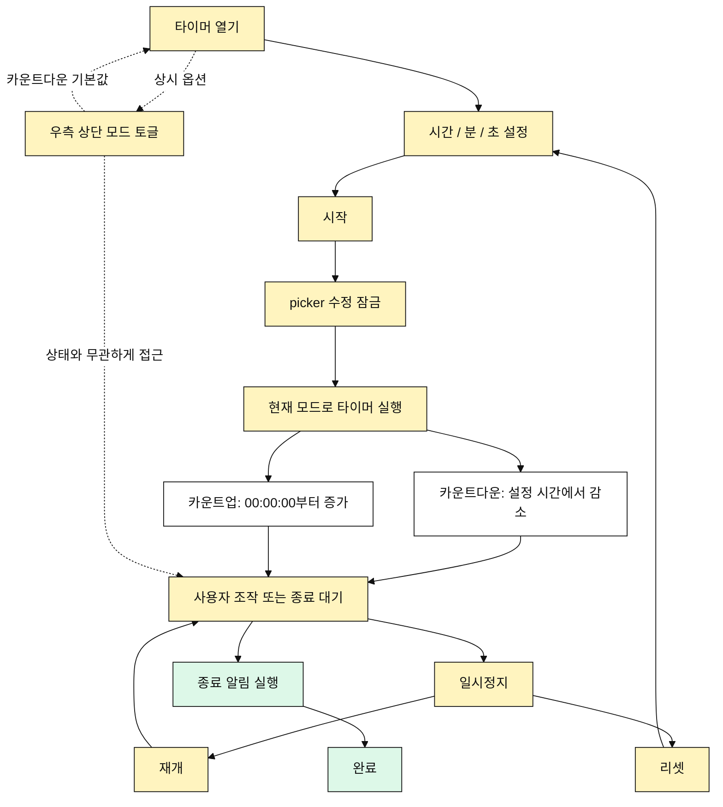

# 타이머 유즈케이스

## 목적

사용자는 하나의 타이머 화면에서 카운트다운과 카운트업을 토글로 전환해 실행한다.
기본 모드는 카운트다운이다.

## 주요 사용자

- 개인 운동자
- 코치
- 수업 진행자
- 시간 제한 운동을 진행하는 사용자

## 선행 조건

- 사용자는 타이머 화면에 접근할 수 있다.
- 타이머는 처음 열릴 때 카운트다운 모드로 표시된다.
- 화면 우측 상단에는 카운트다운과 카운트업을 즉시 전환하는 토글 버튼이 있다.
- 사용자는 시간, 분, 초를 드래그 picker로 설정할 수 있다.

## 기본 흐름

1. 사용자가 타이머를 연다.
2. 사용자가 시간, 분, 초를 드래그로 설정한다.
3. 사용자가 시작 버튼을 누른다.
4. 앱은 picker를 수정 불가 상태로 전환한다.
5. 현재 모드로 타이머를 실행한다.
6. 카운트다운 모드는 설정 시간에서 `00:00:00`까지 감소한다.
7. 카운트업 모드는 `00:00:00`에서 설정 시간까지 증가한다.
8. 종료 시 알림 큐와 네이티브 알림 배너를 실행한다.

## 상시 옵션

- 타이머는 카운트다운 모드로 열린다.
- 화면 우측 상단에는 카운트다운과 카운트업을 즉시 전환하는 토글 버튼이 있다.
- 카운트업은 기본 흐름의 별도 단계가 아니라 사용자가 언제든 접근할 수 있는 옵션이다.
- 토글 버튼은 타이머 상태와 무관하게 항상 접근 가능해야 한다.

## 대안 흐름

- 사용자는 실행 중 일시정지할 수 있다.
- 사용자는 일시정지 상태에서 재개할 수 있다.
- 사용자는 일시정지 상태에서 리셋할 수 있다.
- 입력 시간이 `00:00:00`이면 시작할 수 없다.
- 사용자가 알림 권한을 거부하면 네이티브 배너는 표시하지 않는다.

## Mermaid

## 검수 포인트

- 타이머의 기본 모드는 카운트다운이다.
- 카운트다운과 카운트업은 별도 메뉴가 아니라 화면 우측 상단 토글 버튼으로 제공된다.
- 카운트업 전환은 기본 흐름의 단계가 아니라 타이머 상태와 무관하게 상시 접근 가능한 옵션이다.
- 시간, 분, 초는 키보드가 아니라 드래그 picker로 설정한다.
- 실행 중에는 picker를 수정할 수 없다.
- 일시정지 상태에서 재개와 리셋이 가능하다.
- 카운트다운은 `00:00:00`에서 종료된다.
- 카운트업은 설정 시간에 도달하면 종료된다.
- 종료 시 진동, 사운드 큐, 네이티브 알림 배너를 실행할 수 있다.
