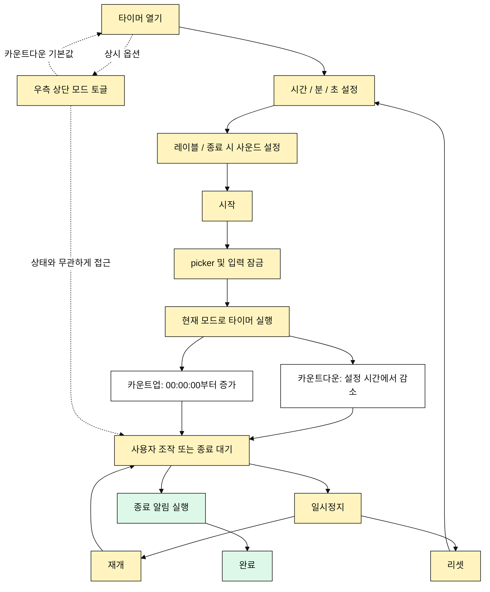

# 타이머 유즈케이스

## 목적

사용자는 하나의 타이머 화면에서 카운트다운과 카운트업을 토글로 전환해 실행한다.
기본 모드는 카운트다운이다. 화면 구성과 조작 방식은 iOS 기본 시계 앱의 타이머와 거의 동일하게 만들어, 아이폰 사용자라면 별도 설명 없이 바로 쓸 수 있게 한다.

## 주요 사용자

- 개인 운동자
- 코치
- 수업 진행자
- 시간 제한 운동을 진행하는 사용자

## 선행 조건

- 사용자는 타이머 화면에 접근할 수 있다.
- 타이머는 처음 열릴 때 카운트다운 모드로 표시된다.
- 화면 우측 상단에는 카운트다운과 카운트업을 즉시 전환하는 토글 버튼이 있다.
- 사용자는 시간, 분, 초를 드래그 picker로 설정할 수 있다.
- 시간은 `00~23`, 분과 초는 `00~59` 범위에서 선택할 수 있다.

## 화면 구성

- 시간/분/초가 하나로 합쳐진 카운트다운 picker(대기 상태에서만 보인다).
- **레이블**: 타이머 이름을 입력하는 텍스트 필드. 기본값(입력값)은 없고 "타이머"를
  placeholder로 보여준다. 비워두면 "타이머"로 처리한다. 면 삶기, 휴식시간, 운동처럼
  실제 용도로 바꿔 쓸 수 있다.
- **타이머 종료 시**: 탭하면 종료 알림 사운드를 고르는 화면으로 이동한다. "없음" 또는 기본 제공 사운드 중에서 선택한다.
- 대기 상태에서는 하단 좌측에 버튼이 없고, 우측 원형 **시작** 버튼만 있다.
- 실행 중에는 picker와 레이블/사운드 입력 폼이 사라지고, 레이블이 큰 시간 표시 위쪽에
  대신 표시된다. 우측에는 상태에 따라 원형 **일시정지**/**재개** 버튼이, 일시정지 중에는
  좌측에 원형 **리셋** 버튼이 추가로 나타난다.

## 기본 흐름

1. 사용자가 타이머를 연다.
2. 사용자가 시간, 분, 초를 드래그로 설정한다. 필요하면 레이블과 종료 시 사운드도 지정한다.
3. 사용자가 시작 버튼을 누른다.
4. 앱은 picker와 레이블/사운드 입력을 수정 불가 상태로 전환한다.
5. 현재 모드로 타이머를 실행한다.
6. 카운트다운 모드는 설정 시간에서 `00:00:00`까지 감소한다.
7. 카운트업 모드는 `00:00:00`에서 설정 시간까지 증가한다.
8. 종료 시 설정한 알림 큐(사운드)와 네이티브 알림 배너를 실행한다.

## 상시 옵션

- 타이머는 카운트다운 모드로 열린다.
- 화면 우측 상단에는 카운트다운과 카운트업을 즉시 전환하는 토글 버튼이 있다.
- 카운트업은 기본 흐름의 별도 단계가 아니라 사용자가 언제든 접근할 수 있는 옵션이다.
- 토글 버튼은 타이머 상태와 무관하게 항상 접근 가능해야 한다.

## 대안 흐름

- 사용자는 실행 중 일시정지할 수 있다.
- 사용자는 일시정지 상태에서 재개할 수 있다.
- 사용자는 일시정지 상태에서 리셋할 수 있다.
- 입력 시간이 `00:00:00`이면 시작할 수 없다.
- 사용자가 알림 권한을 거부하면 네이티브 배너는 표시하지 않는다.
- 동일 설정(시간/레이블/사운드)을 리셋 후 다시 실행할 수 있다.

## Mermaid

```mermaid
%%{init: {"theme": "base", "themeVariables": {"background": "transparent", "primaryColor": "#FFFFFF", "primaryTextColor": "#111111", "primaryBorderColor": "#111111", "lineColor": "#111111", "tertiaryColor": "#F7F7F2"}}}%%
flowchart TD
  A["타이머 열기"] --> B["시간 / 분 / 초 설정"]
  B --> B2["레이블 / 종료 시 사운드 설정"]
  B2 --> C["시작"]
  C --> D["picker 및 입력 잠금"]
  D --> E["현재 모드로 타이머 실행"]
  E --> F["카운트다운: 설정 시간에서 감소"]
  E --> G["카운트업: 00:00:00부터 증가"]
  F --> H["사용자 조작 또는 종료 대기"]
  G --> H
  H --> I["일시정지"]
  I --> J["재개"]
  J --> H
  I --> K["리셋"]
  K --> B
  H --> L["종료 알림 실행"]
  L --> M["완료"]
  A -. "상시 옵션" .-> N["우측 상단 모드 토글"]
  N -. "카운트다운 기본값" .-> A
  N -. "상태와 무관하게 접근" .-> H

  classDef action fill:#FFF4BF,stroke:#111111,color:#111111;
  classDef done fill:#DDF8E8,stroke:#111111,color:#111111;
  classDef error fill:#FFE0E0,stroke:#111111,color:#111111;
  class A,B,B2,C,D,E,H,I,J,K,N action;
  class L,M done;
```

## 검수 포인트

- 타이머의 기본 모드는 카운트다운이다.
- 카운트다운과 카운트업은 별도 메뉴가 아니라 화면 우측 상단 토글 버튼으로 제공된다.
- 카운트업 전환은 기본 흐름의 단계가 아니라 타이머 상태와 무관하게 상시 접근 가능한 옵션이다.
- 시간, 분, 초는 키보드가 아니라 드래그 picker로 설정한다.
- 시간은 `00~23`, 분과 초는 `00~59`까지 선택할 수 있다.
- 레이블을 입력할 수 있다. 비워두면 "타이머"로 처리한다.
- 종료 시 사운드를 선택할 수 있다("없음" 포함).
- 대기 상태에는 우측 원형 시작 버튼만 있고, 좌측에는 버튼이 없다.
- 실행 중에는 picker와 레이블/사운드 입력 폼이 화면에서 사라지고, 레이블만 시간 표시
  위쪽에 대신 표시된다.
- 일시정지 상태에서 재개와 리셋이 가능하다.
- 카운트다운은 `00:00:00`에서 종료된다.
- 카운트업은 설정 시간에 도달하면 종료된다.
- 종료 시 진동, 사운드 큐, 네이티브 알림 배너를 실행할 수 있다.
